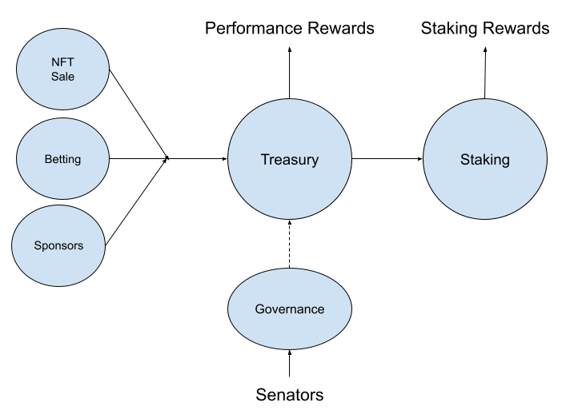

# Concepts of SportsDAO

It is a conceptual repository of brand new `SportsDAO`, firstly introduced to the world with Qatar2022 World Cup, by SportsNFTWorld members.

`SportsDAO` is a decentralized autonomous organization, mainly focusing on Sports enthusiasts, to collect and distribute rewards.



## Elements of SportsDAO

- Governance NFT
- Treasury
- Staking
- Incomes Sources(like Betting, SponsorEngagement)
- Governors

## How it works?

All incomes generated by Sports competitions and movements will be collected into the treasury, and will be distributed to the community members as the staking dividends.

## Build

```
npx hardhat compile
npx hardhat test
```